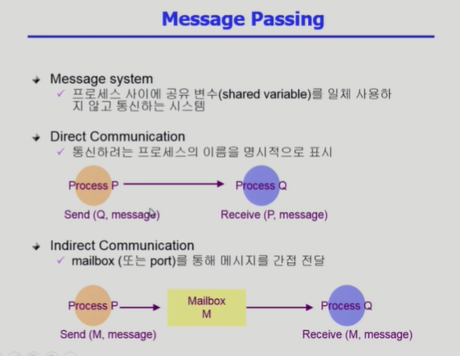
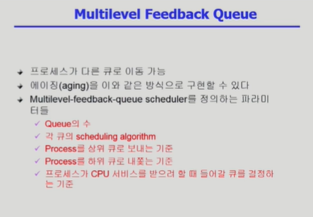

# 운영체제 - 이화여자대학교 : 반효경

## 운영체제란?

운영체제란?
  - 컴퓨터 하드웨어 바로 위에 설치되어 사용자 및 다른 모든 소프트웨어와 하드웨어를 연결하는 소프트웨어 계층

운영체제의 목적
  1. 컴퓨터 시스템을 편리하게 사용할 수 있는 환경을 제공
    - 운영체제는 동시 사용자/프로그램들이 각각 독자적 컴퓨터에서 수행되는 것 같은 환상을 제공
    - 하드웨어를 직접 다루는 복잡한 부분을 운영체제가 대행

  2. 컴퓨터 시스템의 자원을 효율적으로 관리 ⭐
    - CPU, 메모리, I/O 디바이스 등의 효율적 관리
      - 주어진 자원으로 최대한의 성능을 내도록 => 효율성
      - 특정 사용자/프로그램의 지나친 불이익이 발생하지 않도록 => 형평성
    - 사용자 및 운영체제 자신의 보호
    - 실행중인 프로그램들에게 짧은 시간씩 CPU를 번갈아 할당
    - 실행중인 프로그램들에 메모리 공간(유한한 공간)을 적절히 분배

컴퓨터 시스템의 구조
  - 컴퓨터 내부 : CPU, 메모리(프로그램 A,B,C 운영체제(핵심 : 커널))
  - 입출력(I/O) 디바이스 : 디스크, 키보드, 프린트, 모니터
    - CPU의 작업 공간을 메모리라고 볼 수 있으며, 기본적으로 CPU는 컴퓨터 내부에 메모리에만 접근할 수 있기 때문에 입출력(I/O) 디바이스 중 디스크의 파일이 필요할 때는 입출력(I/O) 디바이스에 따로 붙어있는 I/O 컨트롤러라는 일종의 작은 CPU와 메모리에 올라온 파일을 올려서 그 파일을 컴퓨터 내부의 메모리에 올려 CPU가 그 파일을 읽는다
    
운영체제의 기능  
  - CPU 스케줄링 : 어떤 프로그램에게 CPU 사용권을 줄까?
  - 메모리 관리 : 한정된 메모리를 어떻게 쪼개어 쓰지?
  - 디스크 스케줄링 : 디스크에 들어온 요청을 어떤 순서로 처리할까?(요청이 들어온 순서대로 하면 비효율적 나중에 들어온 요청이라고 할지라도 그것을 먼저 처리하는 것이 효율적이라고 판단된다면 순서를 뒤집는 것이 디스크 스케줄링의 기능)
  - 인터럽트, 캐싱 : 빠른 CPU와 느린 I/O 장치간 속도차를 어떻게 극복하지?
    - 캐싱 : 중간 계층을 두는 것
    - 인터럽트 : CPU가 프로그램을 실행하고있을 때, 입출력하드웨어(I/O 장치) 등의 장치에 예외상황이 발생하여 처리가 필요할 경우에 CPU에게 알려 처리할 수 있도록 하는 것

  CPU 스케줄링
    1. CPU 스케줄링 FCFS(First-Come First-Served)
      1) 프로세스의 도착 순서 : p1, p2, p3
      waiting time : p1=0; p2=24;, p3=27
      average waiting time = (0+24+27)/3 = 17

      2) 프로세스의 도착 순서 : p2, p3, p1
      waiting time : p1=6; p2=0;, p3=3
      average waiting time = (6+0+3)/3 = 3

      해당 방법은 프로세스 사용시간이 더 오래 걸리는 것이 더 먼저 도착했는지 나중에 도착했는지에 따라 밸류에이션이 굉장히 커짐

    2. CPU 스케줄링 SJF(Shortest-Job-First)
      - 금번 CPU 사용시간이 가장 짧은 프로세스를 제일 먼저 스케줄
      - SJF는 minimum average waiting time을 보장
      - 프로세스의 도착 순서 : p1 : 24s, p2 : 4s, p3 : 2s
      - 프로세스의 처리 순서 : p3, p2, p1
      - 문제 : Starvation(기아 현상) 발생 가능(형평성이 떨어짐)

    3. CPU 스케줄링 Round Robin(RR)
      - 각 프로세스는 동일 크기의 CPU 할당시간을 가짐
      - 할당시간이 끝나면 인터럽트가 발생하여 프로세스는 CPU를 빼앗기고 CPU 큐의 제일 뒤에 줄을 섬
      - n개의 프로세스가 CPU 큐에 있는 경우
        - 어떤 프로세스도 (n-1)*할당시간 이상 기다리지 않음
        - 대기시간이 프로세스의 CPU 사용시간에 비례

  메모리 관리
    한정된 메모리 내에 새롭게 들어오는 페이지를 처리하기 위해서 어떻게 해야하는가?
    예를 들어 메모리 공간이 4페이지 밖에 없을 경우 5번째 페이지를 보관하기 위해서는 어떤 페이지를 삭제해야하는지 골라야할 때 두가지 방법을 고려해볼 수 있다
      - LRU(가장 오래 전에 참조 페이지 삭제)
      - LFU(참조횟수가 가장 적은 페이지 삭제)

  디스크 스케줄링
    디스크 접근 시간의 구성
      - 탐색시간(Seek time) : 헤드를 해당 트랙(실린더)으로 움직이는데 걸리는 시간
      - 회전지연(Rotational latency) : 헤드가 원하는 섹터에 도달하기까지 걸리는 시간
      - 전송시간(Transfer time) : 실제 데이터의 전송 시간

    디스크 스케줄링(Disk Scheduling)
      - seek time을 최소화하는 것이 목표
      - seek time = seek distance

      디스크 스케줄링 SCAN
        - 헤드가 디스크의 한쪽 끝에서 다른쪽 끝으로 이동하며 가는 길목에 있는 모든 요청을 처리한다
        - 다른 한쪽 끝에 도달하면 역방향으로 이동하며 오는 길목에 있는 모든 요청을 처리하며 다시 반대쪽 끝으로 이동한다

    저장장치 계층구조와 캐싱
      primary(executable)
      - 레지스터
      - 캐시 메모리
      - 메인 메모리
      secondary
      - 마그네틱 디스크
      - 옵티컬 디스크
      - 마그네틱 테이프

      - 위로 올라갈수록 빠르고 비싸며, primary(executable) 부분은 CPU에서 접근이 가능하며 휘발성의 특징을 갖고 있으며 secondary은 I/O 의 영역으로 CPU에서 직접 접근이 불가능하며 휘발성의 특징을 갖지 않는다
      - 캐싱 계층을 두는 이유는 장치간 속도 차이를 완충 : 중간에 데이터를 복사를 해놓음으로서 장치간 이동을 끝까지 내려갔다가 다시 올라가는 것이 아니라 중간에 데이터를 저장해놓은 캐싱까지만 감으로서 장치간 속도 차이를 완충할 수 있다

    플래시메모리
      - 플래시메모리
        - 반도체장치(하드디스크: 마그네틱)
        - NAND형(스토리지), NOR형(임베디드 코드저장용)

      - 플래시메모리의 특징
        - Nonvolatile
        - Low power consumption
        - Shock resistance
        - Small size
        - Lightweight
        - 쓰기 횟수 제약

      - 플래시메모리의 사용형태
        - 휴대폰, PDA 등 임베디드 시스템 구성용
        - USB용 메모리 스틱
        - 디지털카메라 등의 SD카드
        - 모바일 장치 뿐 아니라 대용량 시스템에서 SSD란 이름으로 하드디스크 대체 시도

# 컴퓨터시스템의 구조

## 운영 체제란?

운영 체제란?
  - 컴퓨터 하드웨어 바로 위에 설치되어 사용자 및 다른 모든 소프트웨어와 하드웨어를 연결하는 소프트웨어 계층
  - 협의의 운영체제(커널)
    - 운영체제의 핵심 부분으로 메모리에 상주하는 부분
  - 광의의 운영체제
    - 커널 뿐 아니라 각종 주변 시스템 유틸리티를 포함한 개념

  운영 체제의 목적
  1. 컴퓨터 시스템을 편리하게 사용할 수 있는 환경을 제공
    - 운영체제는 동시 사용자/프로그램들이 각각 독자적 컴퓨터에서 수행되는 것 같은 환상을 제공
    - 하드웨어를 직접 다루는 복잡한 부분을 운영체제가 대행

  2. 컴퓨터 시스템의 자원을 효율적으로 관리 ⭐
    - 프로세서, 기억장치, 입출력 장치 등의 효율적 관리
      - 사용자간의 형평성 있는 자원 분배(실행중인 프로그램들에게 짧은 시간씩 CPU를 번갈아 할당, 실행중인 프로그램들에 메모리 공간을 적절히 분배)
      - 주어진 자원으로 최대한의 성능을 내도록
    - 사용자 및 운영체제 자신의 보호
    - 프로세스, 파일, 메시지 등을 관리
  
  운영 체제의 분류
    - 동시 작업 가능 여부
      - 단일 작업(single tasking)
        - 한 번에 하나의 작업만 처리
          예) MS-DOS 프롬프트 상에서는 한 명령의 수행을 끝내기 전에 다른 명령을 수행시킬 수 없음

      - 다중 작업(multi tasking)
        - 동시에 두 개 이상의 작업 처리
          예) UNIX, MS Windows 등에서는 한 명령의 수행이 끝나기 전에 다른 명령이나 프로그램을 수행할 수 있음

    - 사용자의 수(동시에)
      - 단일 사용자(single user)
        예) MS-DOS, MS Windows

      - 다중 사용자(multi user)
        예) UNIX, NT server

    - 처리방식
      - 일괄처리(batch processing)
        - 작업 요청이 일정량 모아서 한꺼번에 처리
        - 작업이 완전 종료될 때까지 기다려야 함
        예) 초기 Punch Card 처리 시스템

      - 시분할(time sharing)
        - 여러 작업을 수행할 때 컴퓨터 처리 능력을 일정한 시간 단위로 분할하여 사용
        - 일괄 처리 시스템에 비해 짧은 응답 시간을 가짐
          예) UNIX
        - interactive(상호활동적인) 한 방식

      - 실시간(Realtime OS)
        - 정해진 시간 안에 어떠한 일이 반드시 종료됨이 보장되어야하는 실시간시스템을 위한 OS
        - 예) 원자로/공장 제어, 미사일 제어, 반도체 장비, 로보트 제어

      - 실시간 시스템의 개념 확장
        - Hard realtime system(경성 실시간 시스템)
        - Soft realtime system(연성 실시간 시스템)

    용어
    - Multitasking
    - Multiprogramming
    - Time sharing
    - Multi process
      - 구분
        - 위의 용어들은 컴퓨터에서 여러 작업을 동시에 수행하는 것을 뜻한다
        - Multiprogramming은 여러 프로그램이 메모리에 올라가 있음을 강조
        - Time sharing은 CPU의 시간을 분할하여 나누어 쓴다는 의미를 강조

    - Multiprocessor
      - 하나의 컴퓨터에 CPU (Processor)가 여러 개 붙어 있음을 의미

  운영체제의 구조  
  - CPU 스케줄링 : 어떤 프로그램에게 CPU 사용권을 줄까?
  - 메모리 관리 : 한정된 메모리를 어떻게 쪼개어 쓰지?
  - 파일 관리 : 디스크에 파일을 어떻게 보관하지?
  - 입출력 관리 : 각기 다른 입출력장치와 컴퓨터 간에 어떻게 정보를 주고 받게 하지?
  - 프로세스 관리
    - 프로세스의 생성과 삭제
    - 자원 할당 및 반환
    - 프로세스 간 협력

  컴퓨터 시스템의 구조

  

    Mode bit
      - 사용자 프로그램의 잘못된 수행으로 다른 프로그램 및 운영체제에 피해가 가지 않도록 하기 위한 보호 장치 필요
      - Mode bit을 통해 하드웨어적으로 두 가지 모드의 operation 지원
        1 사용자 모드 : 사용자 프로그램 수행
        0 모니터 모드(=커널모드, 시스템모드) : OS 코드 수행
        - 보안을 해칠 수 있는 중요한 명령어는 모니터 모드에서만 수행 가능한 '특정명령'으로 규정
        - Interrupt나 Exception 발생시 하드웨어가 mode bit을 0으로 바꿈
        - 사용자 프로그램에게 CPU를 넘기기 전에 mode bit을 1로 셋팅

    Timer
      - 타이머
        - 정해진 시간이 흐른 뒤 운영체제에게 제어권이 넘어가도록 인터럽트를 발생시킴
        - 타이머는 매 클럭 틱 때마다 1씩 감소
        - 타이머 값이 0이 되면 타이머 인터럽트 발생
        - CPU를 특정 프로그램이 족접하는 것으로부터 보호
      - 타이머는 time sharing을 구현하기 위해 널리 이용됨
      - 타이머는 현재 시간을 계산하기 위해서도 사용

    Device Controller
      - I/O device controller
        - 해당 I/O 장치유형을 관리하는 일종의 작은 CPU
        - 제어 정보를 위해 control register, status register를 가짐
        - local buffer를 가짐(일종의 data register)
      - I/O는 실제 device와 local buffer 사이에서 일어남
      - Device controller는 I/O가 끝났을 경우 interrupt로 CPU에 그 사실을 알림

      - device driver(장치구동기)
        : OS 코드 중 각 장치별 처리루틴 -> software
      - device controller(장치제어기)
        : 각 장치를 통제하는 일종의 작은 CPU -> hardware

    인터럽트(Interrupt)
      - 현대의 운영체제는 인터럽트에 의해 구동됨
      - 인터럽트
        : 인터럽트 당한 시점의 레지스터와 program counter를 save 한 후 CPU의 제어를 인터럽트 처리 루틴에 넘긴다
      - 인터럽트의 넓은 의미
        - Trap (소프트웨어 인터럽트)
          - Exception : 프로그램이 오류를 범한 경우
          - System call : 사용자 프로그램이 운영체제의 서비스를 받기 위해 커널 함수를 호출하는 것

        - Interrupt (하드웨어 인터럽트 : 디스크 컨트롤러, 타이머) 
        : 하드웨어가 발생시킨 인터럽트 I/O 디바이스에 의한 인터럽트로 프로그램이 하드웨어, I/O 디바이스에 담긴 파일을 읽어와야 할 때, CPU는 직접 접근을 할 수 없기 때문에 I/O 디바이스를 전담하는 Controller에게 부탁(device driver)하여 파일을 불러오며 발생하는 인터럽트

    동기식 입출려과 비동기식 입출력
      - 동기식 입출력(synchronous I/O)
        - I/O 요청 후 입출력 작업이 완료된 후에야 제어가 사용자 프로그램에 넘어감
        - 구현 방법 1
          - I/O가 끝날 때까지 CPU를 낭비시킴
          - 매시점 하나의 I/O만 일어날 수 있음
        - 구현 방법 2
          - I/O가 완료될 때까지 해당 프로그램에게서 CPU를 빼앗음
          - I/O 처리를 기다리는 줄에 그 프로그램에게서 줄 세움
          - 다른 프로그램에게 CPU를 줌
      - 비동기식 입출력(asynchronous I/O)
        - I/O가 시작된 후 입출력 작업이 끝나기를 기다리지 않고 제어가 사용자 프로그램에 즉시 넘어감
      - 두 경우 모두 I/O의 완료는 인터럽트로 알려줌

    DMA(Direct Memory Access)
      - DMA (Direct Memory Access)
        - 빠른 입출력 장치를 메모리에 가까운 속도로 처리하기 위해 사용
        - CPU의 중재 없이 device controller가 device의 buffer storage의 내용을 메모리에 block 단위로 직접 전송
        - 바이트 단위가 아니라 block 단위로 인터럽트를 발생시킴

# 프로세스 관리

프로그램의 실행(메모리 load)

  프로그램 실행 -> 각자의 주소공간(가상 메모리) : 코드, 데이터, 스택 ->(Address transition)-> 물리적 메모리

커널 주소 공간의 내용
  - code : 커널 코드
    - 시스템콜, 인터럽트 처리 코드
    - 자원관리를 위한 코드
    - 편리한 서비스 제공을 위한 코드
  - data : PCB, CPU, mem, disk
  - stack : 프로세스별 커널 스택

사용자 프로그램이 사용하는 함수
  - 함수(function)
    - 사용자 정의 함수
      : 자신의 프로그램에서 정의한 함수
    - 라이브러리 함수
      - 자신의 프로그램에서 정의하지 않고 갖다 쓴 함수
      - 자신의 프로그램의 실행 파일에 포함되어 있다
    - 커널 함수
      - 운영체제 프로그램의 함수
      - 커널 함수의 호출 = 시스템콜

프로세스의 개념

  
  - "Process is program in execution" : 실행중인 프로그램
  - 프로세스의 문맥(context)
    - CPU 수행 상태를 나타내는 하드웨어 문맥
      - Program Counter
      - 각종 register
    - 프로세스의 주소 공간
      - code, data, stack
    - 프로세스 관련 커널 자료 구조
      - PCB(Process Control Block)
      - Kernel stack

프로세스의 상태

  
  - 프로세스의 상태가 변경되며 수행된다
    - Running
      - CPU를 잡고 instruction을 수행 중인 상태
    - Ready
      - CPU를 기다리는 상태(메모리 등 다른 조건을 모두 만족하고)
    - Blocked(wait, sleep)
      - CPU를 주어도 당장 instruction을 수행할 수 없는 상태
      - Process 자신이 요청한 event(예 : I/O)가 즉시 만족되지 않아 이를 기다리는 상태
      - 예) 디스크에서 file을 읽어와야 하는 경우
    - Suspended(stopped)
      - 외부적인 이유로 프로세스의 수행이 정지된 상태
      - 프로세스는 통째로 디스크에 swap out 된다
      - 예) 사용자가 프로그램을 일시 정지시킨 경우(break key) 시스템이 여러 이유로 프로세스를 잠시 중단시킴(메모리에 너무 많은 프로세스가 올라와 있을 때)

      * Blocked : 자신이 요청한 event가 만족되면 Ready
        Suspended : 외부에서 resume해주어야 Active

Process Control Block(PCB)
  - PCB
    - 운영체제가 각 프로세스를 관리하기 위해 프로세스당 유지하는 정보
    - 다음의 구성 요소를 가진다(구조체로 유지) 
      (1) OS가 관리상 사용하는 정보
        - Process state, Process ID
        - scheduling information, priority
      (2) CPU가 수행 관련 하드웨어 값
        - Program counter, register
      (3) 메모리 관련
        - Code, data, stack의 위치 정보
      (4) 파일 관련
        - Open file descriptors 

문맥 교환(Context Switch)
  - CPU를 한 프로세스에서 다른 프로세스로 넘겨주는 과정
  - CPU가 다른 프로세스에게 넘어갈 때 운영체제는 다음을 수행
    - CPU를 내어주는 프로세스의 상태를 그 프로세스의 PCB에 저장
    - CPU를 새롭게 얻는 프로세스의 상태를 PCB에서 읽어옴

프로세스를 스케줄링하기 위한 큐
  - Job queue : 현재 시스템 내에 있는 모든 프로세스의 집합
  - Ready queue : 현재 메모리 내에 있으면서 CPU를 잡아서 실행되기를 기다리는 프로세스의 집합
  - Device queues : I/O device의 처리를 기다리는 프로세스의 집합
  - 프로세스들은 각 큐들을 오가며 수행된다

스케줄러
  - Long-term scheduler(장기 스케줄러 or job scheduler)
    - 시작 프로세스 중 어떤 것들을 ready queue로 보낼지 결정
    - 프로세스에 memory(및 각종 자원)을 주는 문제
    - degree of Multiprogramming을 제어
    - time sharing system에는 보통 장기 스케줄러가 없음(무조건 ready)
  - Short-term scheduler(단기 스케줄러 or CPU scheduler)
    - 어떤 프로세스를 다음번에 running 시킬지 결정
    - 프로세스에 CPU를 주는 문제
    - 충분히 빨라야 함(millisecond 단위)
  - Medium-term scheduler(중기 스케줄러 or Swapper)
    - 여유 공간 마련을 위해 프로세스를 통째로 메모리에서 디스크로 쫓아냄
    - 프로세스에게서 memory를 뺏는 문제
    - degree of Multiprogramming을 제어

프로세스의 상태도

  

Thead(CPU 수행의 실행단위)
  - "A thead(or lightweight process) is a basic unit of CPU utilization"
  - Thead의 구성
    - program counter
    - register set
    - stack space
  
  - Thead가 동료 thead와 공유하는 부분(=task)
    - code section
    - data section
    - OS resources

  - 전통적인 개념의 heavyweight process는 하나의 thead를 가지고 있는 task로 볼 수 있다

  - 다중 스레드로 구성된 태스크 구조에서는 하나의 서버 스레드가 blocked(waiting) 상태인 동안에도 동일한 태스크 내의 다른 스레드가 실행(running)되어 처리를 할 수 있다

  - 동일한 일을 수행하는 다중 스레드가 협력하여 높은 처리율(throughput)과 성능 향상을 얻을 수 있다

  - 스레드를 사용하면 병렬성을 높일 수 있다
  
  

Benefits of Threads

  - Responsiveness : 응답성이 빠르다
  - Resource Sharing : 자원공유(동일 프로세스의 스레드)
  - Economy : 효율적(경제성)
  - Utilization of MP Architectures : 병렬성

프로세스 생성(Process Creation)

  - 부모 프로세스가 자식 프로세스 생성 : fork()
  
  - 프로세스의 트리(계층 구조)형성

  - 프로세스는 자원을 필요로 함
    - 운영체제로부터 받는다
    - 부모와 공유한다 : 가끔, 보통은 경쟁

  - 자원의 공유
    - 부모와 자식이 모든 자원을 공유하는 모델
    - 일부를 공유하는 모델
    - 전혀 공유하지 않는 모델

  - 수행(Execution)
    - 부모와 자식은 공존하며 수행되는 모델
    - 자식이 종료(terminate)될 때까지 부모가 기다리는(wait) 모델

  - 주소 공간(Address space)
    - 자식은 부모의 공간을 복사함(binary and OS data)
    - 자식은 그 공간에 새로운 프로그램을 올림

  - 유닉스의 예
    - fork() 시스템 콜이 새로운 프로세스를 생성
      - 부모을 그대로 복사(OS data except PID + binary)
      - 주소 공간 할당
    - fork 다음에 이어지는 exec() 시스템 콜을 통해 새로운 프로그램을 메모리에 올림

프로세스 종료(Process Termination)

  - 프로세스가 마지막 명령을 수행한 후 운영체제에게 이를 알려줌(exit)
    - 자식이 부모에게 output data를 보냄(via wait)
    - 프로세스의 각종 자원들이 운영체제에게 반납됨

  - 부모 프로세스가 자식의 수행을 종료시킴(abort)
    - 자식이 할당 자원의 한계치를 넘어섬
    - 자식에게 할당된 태스크가 더 이상 필요하지 않음
    - 부모가 종료(exit)하는 경우
      - 운영체제는 부모 프로세스가 종료하는 경우 자식이 더 이상 수행되도록 두지 않는다
      - 단계적인 종료

프로세스 관련한 시스템 콜
  - fork() : create a child(copy)
  - exec() : overlay new image
  - wait() : sleep until child is done
  - exit() : frees all the resources, notify parent

  fork() 시스템콜
    - A process is created by the fork() system call
      - creates a new address space that is a duplicate of the caller

  exec() 시스템콜
    - A process can execute a different program by the exec() system call
      - replaces the memory image of the caller with a new program

  wait() 시스템콜
    - 프로세스 A가 wait() 시스템 콜을 호출하면
      - 커널은 child가 종료될 때까지 프로세스 A를 sleep 시킨다(block 상태)
      - Child process가 종료되면 커널은 프로세스 A를 깨운다(replay 상태)

  exit() 시스템 콜
    - 프로세스의 종료
      - 자발적 종료
        - 마지막 statement 수행 후 exit() 시스템 콜을 통해
        - 프로그램에 명시적으로 적어주지 않아도 main 함수가 리턴되는 위치에 컴파일러가 넣어줌

      - 비자발적 종료
        - 부모 프로세스가 자식 프로세스를 강제 종료시킴
          - 자식 프로세스가 한계치를 넘어서는 자원 요청
          - 자식에게 할당된 태스크가 더 이상 필요하지 않음
        - 키보드로 kill, break 등을 친 경우
        - 부모가 종료하는 경우
          - 부모 프로세스가 종료하기 전에 자식들이 먼저 종료됨

프로세스 간 협력

  - 독립적 프로세스
    - 프로세스는 각자의 주소 공간을 가지고 수행되므로 원칙적으로 하나의 프로세스는 다른 프로세스의 수행에 영향을 미치지 못함
  
  - 협력 프로세스
    - 프로세스 협력 메커니즘을 통해 하나의 프로세스가 다른 프로세스의 수행에 영향을 미칠 수 있음

  
  - 프로세스 간 협력 메커니즘(IPC : InterProcess Communication)
      
      

    - 메세지를 전달하는 방법
      - message passing : 커널을 통해 메시지 전달
        
        

    - 주소 공간을 공유하는 방법
      - shared memory : 서로 다른 프로세스 간에도 일부 주소 공간을 공유하게 하는 shared memory 메커니즘이 있음

      - thread : thread는 사실상 하나의 프로세스이므로 프로세스 간 협력으로 보기는 어렵지만 동일한 process를 구성하는 thread 들 간에는 주소 공간을 공유하므로 협력이 가능

# CPU 스케줄링

  - CPU-burst Time의 분포

  

  - 프로세스의 특성 분류
    - 프로세스는 그 특성에 따라 다음 두 가지로 나눔
      - I/O-bound process
        - CPU를 잡고 계산하는 시간보다 I/O에 많은 시간이 필요한 job
        - (many short CPU bursts)

      - CPU-bound process
        - 계산 위주의 job
        - (few very long CPU bursts)

  - CPU Scheduler & Dispatcher
    - CPU Scheduler
      - Replay 상태의 프로세스 중에서 이번에 CPU를 줄 프로세스를 고른다
    
    - Dispatcher
      - CPU의 제어권을 CPU scheduler에 의해 선택된 프로세스에게 넘긴다
      - 이 과정을 context switch(문맥 교환)라고 한다

    - CPU 스케줄링이 필요한 경우는 프로세스에게 다음과 같은 상태 변화가 있는 경우이다
      1. Running -> Blocked(예: I/O 요청하는 시스템 콜)
      2. Running -> Replay(예: 할당하는 시간만료로 timer Interrupt)
      3. Blocked -> Replay(예: I/O 완료 후 인터럽트)
      4. Terminate

      * 1번, 4번 에서의 스케줄링은 nonpreemptive(=강제로 빼앗지 않고 자진 반납)
      * 2번, 3번 스케줄링은 preemptive(=강제로 빼앗음)

  - Scheduling Criteria

  

  - Scheduling Algorithms
    - FCFS(First-Come First-Served)

       
    
    - SJF(Shortest-Job-First)

      
    
    - Priority Scheduling

      

    - Round Robin(RR)

      

    - Multilevel Queue

      

    - Multilevel Feedback Queue

      

    - Real-Time Scheduling
      - Hard real-time task는 정해진 시간 안에 반드시 끝내도록 스케줄링해야 함
      - Soft-real-time task는 일반 프로세스에 비해 높은 priority를 갖도록 해야 함

    - Thread Scheduling
      - Local Scheduling
        : User level thread의 경우 사용자 수준의 thread library에 의해 어떤 thread를 스케줄할지 결정
      - Global Scheduling
        : Kernel level thread의 경우 일반 프로세스와 마찬가지로 커널의 단기 스케줄러가 어떤 thread를 스케줄할지 결정

    - Algorithm Evaluation
      - Queueing models
        : 확률 분포로 주어지는 arrival rate와 service rate 등을 통해 각종 performance index 값을 계산

      - Implementation(구현) & Measurement(성능 측정)
        : 실제 시스템에 알고리즘을 구현하여 실제 작업(workload)에 대해서 성능을 측정 비교

      - Simulation(모의 실현)
        : 알고리즘을 모의 프로그램으로 작성 후 trace를 입력으로 하여 결과 비교

# 병행제어

  - Race Condition
    : Memory Address Space를 공유하는 CPU Process가 여럿 있는 경우 Race Condition의 가능성이 있음

  - OS에서 race condition은 언제 발생하는가?
    1. kernel 수행 중 인터럽트 발생 시
      - 커널모드 running 중 interrupt가 발생하여 인터럽트 처리루틴이 수행
        -> 양쪽 다 커널 코드이므로 kernel address space 공유
      - 해결방안 : disable/enable interrupt

    2. Process가 system call을 하여 kernel mode로 수행 중인데 context switch가 일어나는 경우
      * 두 프로세스의 address space 간에는 data sharing이 없음
      ** 그러나 system call을 하는 동안에는 kernel address space의 data를 access하게 됨(share)
      *** 이 작업 중간에 CPU를 preempt 해가면 race condition 발생 
      **** 해결책 : 커널 모드에서 수행 중일 때는 CPU를 preempt하지 않음, 커널 모드에서 사용자 모드로 돌아갈 때 preempt

    3. Multiprocessor에서 shared memory 내의 kernel data 
      - 어떤 CPU가 마지막으로 count를 store 했는가? -> race condition
        multiprocessor의 경우 interrupt enable/disable로 해결되지 않음
      
      (해결 방법 1) 한번에 하나의 CPU만이 커널에 들어갈 수 있게 하는 방법

      (해결 방법 2) 커널 내부에 있는 각 공유 데이터에 접근할 때마다 그 데이터에 대한 lock / unlock을 하는 방법

  - Process Synchronization 문제
    - 공유 데이터(shared data)의 동시 접근(concurrent access)은 데이터의 불일치 문제(inconsistency)를 발생시킬 수 있다.
    - 일관성(consistency) 유지를 위해서는 협력 프로세스(cooperating process) 간의 실행 순서(orderly execution)를 정해주는 메커니즘 필요

    - Race condition
      - 여러 프로세스들이 동시에 공유 데이터를 접근하는 상황
      - 데이터의 최종 연산 결과는 마지막에 그 데이터를 다룬 프로세스에 따라 달라짐

    - race condition을 막기 위해서는 concurrent process는 동기화(synchronize)되어야 한다

  - The Critical-Section Problem

    

  - 프로그램적 해결법의 충족 조건
    - Mutual Exclusion(상호 배제)
      : 프로세스 Pi가 critical section 부분을 수행 중이면 다른 모든 프로세스들은 그들의 critical section에 들어가면 안된다

    - Progress(진행)
      : 아무도 critical section에 있지 않은 상태에서 critical section에 들어가고자 하는 프로세스가 있으면 critical section에 들어가게 해주어야한다.

    - Bounded Waiting(유한대기)
      : 프로세스가 critical section에 들어가려고 요청한 후부터 그 요청이 허용될 때까지 다른 프로세스들이 critical section에 들어가는 횟수에 한계가 있어야 한다.

  - Deadlock and Starvation

    

# 데드락

  - The Deadlock Problem
    - Deadlock
      : 일련의 프로세스들이 서로가가진 자원을 기다리면 block된 상태

    - Resource(자원)
      - 하드웨어, 소프트웨어 등을 포함하는 개념
      - (예) I/O device, CPU cycle, memory space, semaphore 등
      - 프로세스가 자원을 사용하는 절차
        : Request, Allocate, Use, Release
    
    - Deadlock Example
      - 시스템에 2개의 tape drive가 있다
      - 프로세스 P1과 P2 각각이 하나의 tape drive를 보유한 채 다른 하나를 기다리고 있다

    - Deadlock 발생의 4가지 조건
      - Mutual exclusion(상호배제)
        : 매 순간 하나의 프로세스만이 자원을 사용할 수 있음

      - No preemption(비선점)
        : 프로세스는 자원을 스스로 내어놓을 뿐 강제로 빼앗기지 않음

      - Hold and wait(보유대기)
        : 자원을 가진 프로세스가 다른 자원을 기다릴 때 보유 자원을 놓지 않고 계속 가지고 있음

      - Circular wait(환형대기)
        : 자원을 기다리는 프로세스간에 사이클이 형성되어야 함

    - Resource-Allocation_Graph

    

    - Deadlock의 처리방법
      - Deadlock Prevention
        : 자원 할당 시 Deadlock의 4가지 필요조건 중 어느 하나가 만족되지 않도록 하는 것
        
      - Deadlock Avoidance
        - 자원 요청에 대한 부가적인 정보를 이용해서 deadlock의 가능성이 없는 경우에만 자원을 할당
        - 시스템 state가 원래 state로 돌아올 수 있는 경우에만 자원 할당

      - Deadlock Detection and recovery
        : Deadlock 발생은 허용하되 그에 대한 detection 루틴을 두어 deadlock 발견시 recover

      - Deadlock Ignorance
        - Deadlock을 시스템이 책임지지 않음
        - UNIX를 포함한 대부분의 OS가 채택

    - Deadlock Prevention
      - Mutual Exclusion
        : 공유해서는 안되는 자원의 경우 반드시 성립해야 함
      
      - Hold and Wait
        - 프로세스가 자원을 요청할 때 다른 어떤 자원도 가지고 있지 않아야 한다
        - 방법1 : 프로세스 시작 시 모든 필요한 자원을 할당받게 하는 방법
        - 방법2 : 자원이 필요한 경우 보유 자원을 모두 놓고 다시 요청
      
      - No Preemption
        - process가 어떤 자원을 기다려야 하는 경우 이미 보유한 자원이 선점됨
        - 모든 필요한 자원을 얻을 수 있을 때 그 프로세스는 다시 시작된다
        - State를 쉽게 save하고 restore할 수 있는 자원에서 주로 사용(CPU, memory)

      - Circular Wait
        - 모든 자원 유형에 할당 순서를 정하여 정해진 순서대로만 자원 할당

    - Deadlock Avoidance
      - Deadlock Avoidance
        - 자원 요청에 대한 부가정보를 이용해서 자원 할당 deadlock으로 부터 안전한지를 동적으로 조사해서 안전한 경우에만 할당
        - 가장 단순하고 일반적인 모델은 프로세스들이 필요로 하는 각 자원별 최대 사용량을 미리 선언하도록 하는 방법임

    - Deadlock Detection and Recovery
      - Deadlock Detection
        - Resource type 당 single instance인 경우
          : 자원할당 그래프에서의 cycle이 곧 deadlock을 의미
        - Resource type 당 multiple instance인 경우
          : Banker's algorithm과 유사한 방법 활용
      
      - Wait-for graph 알고리즘
        - Resource type 당 single instance인 경우
        - Wait-for graph
          - 자원할당 그래프의 변형
          - 프로세스만으로 node 구성
          - Pi 가 가지고 있는 자원을 Pk가 기다리는 경우 Pk -> Pi
        - Algorithm
          - Wait-for graph에 사이클이 존재하는지를 주기적으로 조사
          - O(n2)
      
      - Recovery
        - Process termination
          - Abort all deadlocked processes
          - Abort one process at a time until the deadlock cycle is eliminated

        - Resource Preemption
          - 비용을 최소화할 victim의 선정
          - safe state로 rollback하여 process를 restart
          - Starvation 문제
            - 동일한 프로세스가 계속해서 victim으로 선정되는 경우
            - cost factor에 rollback 횟수도 같이 고려

    - Deadlock Ignorance
      - Deadlock이 일어나지 않는다고 생각하고 아무런 조치도 취하지 않음
        - Deadlock이 매우 드믈게 발생하므로 deadlock에 대한 조치 자체가 더 큰 overhead 알 수 있음
        - 만약 시스템에 deadlock이 발생한 경우 시스템이 비정상적으로 작동하는 것을 사람이 느낀 후 직접 process를 죽이는 등의 방법으로 대처
        - UNIX, Windows 등 대부분의 범용 OS가 채택

# 메모리 관리

  - Logical(논리적) vs. Physical(물리적) Address
    - Logical address(=virtual address)
      - 프로세스마다 독립적으로 가지는 주소 공간
      - 각 프로세스마다 0번지부터 시작
      - CPU가 보는 주소는 logical address임
  
    - Physical address
      - 메모리에 실제 올라가는 위치

  - 주소 바인딩 : 주소를 결정하는 것
  : Symbolic Address -> Logical Address -> Physical address

    - Compile time binding
      - 물리적 메모리 주소가 컴파일 시 알려짐
      - 시작 위치 변경시 재컴파일
      - 컴파일러는 절대코드(absolute code) 생성

    - Load time binding
      - Loader의 책임하에 물리적 메모리 주소 부여
      - 컴파일러가 재배치가능코드(relocatable code)를 생성한 경우 가능

    - Execution time binding(=Run time binding)
      - 수행이 시작된 이후에도 프로세스의 메모리 상 위치를 옮길 수 있음
      - CPU가 주소를 참조할 때마다 binding을 점검(address mapping table)
      - 하드웨어적인 자원이 필요

  - Memory-Management Unit(MMU)
    - MMU(Memory-Management Unit)
      : logical address를 physical address로 매핑해주는 Hardware device

    - MMU scheme
      : 사용자 프로세스가 CPU에서 수행되며 생성해내는 모든 주소 값에 대해 base register(=relocation register)의 값을 더한다
    
    - user program
      - logical address만을 다룬다
      - 실제 physical address를 볼 수 없으며 알 필요가 없다

    - Hardware Support for Address Translation

      

  - 불연속 할당
    
    - Paging  
      Paging
      - Process의 virtual memory를 동일한 사이즈의 page 단위로 나눔
      - Virtual memory의 내용이 page 단위로 noncontiguous하게 저장됨
      - 일부는 backing storage에 일부는 physical memory에 저장

      Basic method
       - physical memory를 동일한 크기의 frame으로 나눔
       - logical memory를 동일 크기의 page로 나눔(frame과 같은 크기)
       - 모든 가용 frame들을 관리
       - page table을 사용하여 logical address를 physical address로 변환
       - External fragmentation 발생 안함
       - Internal fragmentation 발생 가능 

    - Implementation of Page Table
      - Page table은 main memory에 상주
      - Page-table base register(PTBR)가 Page table을 가리킴
      - Page-table length register(PTLR)가 테이블 크기를 보관
      - 모든 메모리 접근 연산에는 2번의 memory access 필요
      - page table 접근 1번, 실제 data/instruction 접근 1번
      - 속도 향상을 위해 associative register 혹은 translation look-aside buffer(TLB)라 불리는 고속의 lookup hardware cache 사용

    - Two-Level Page Table
      - 현대의 컴퓨터는 address space가 매우 큰 프로그램 지원
        - 32 bit address 사용시 : 2의 32승(4G)의 주소 공간
          - page size가 4K시 1M개의 page table entry 필요
          - 각 page entry가 4B시 프로세스당 4M의 page table 필요
          - 그러나 대부분의 프로그램은 4G의 주소 공간 중 지극히 일부분만 사용하므로 page table 공간이 심하게 낭비됨

        -> page table 자체를 page로 구성
        -> 사용되지 않은 주소 공간에 대한 outer page table의 엔트리 값은 NULL 

    - Multilevel Paging and Performance
      - Address space가 더 커지면 다단계 페이지 테이블 필요
      - 각 단계의 페이지 테이블이 메모리에 존재하므로 logical address의 physical address 변환에 더 많은 메모리 접근 필요
      - TLB를 통해 메모리 접근 시간을 줄일 수 있음
      - 4단계 페이지 테이블을 사용하는 경우
        - 메모리 접근 시간이 100ns, TLB 접근 시간이 20ns이고
        - TLB hit ratio가 98%인 경우
          effective memory access time = 0.98 x 120 + 0.02 x 520
                                       = 128 nanoseconds.
          결과적으로 주소변환을 위해 28ns만 소요