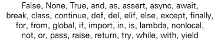
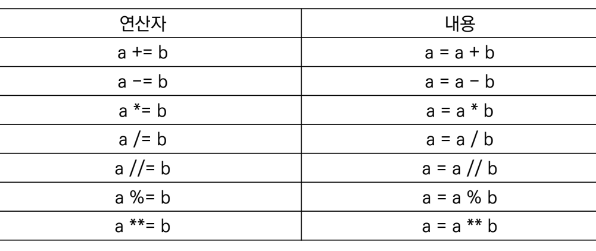
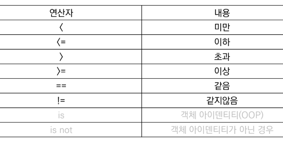
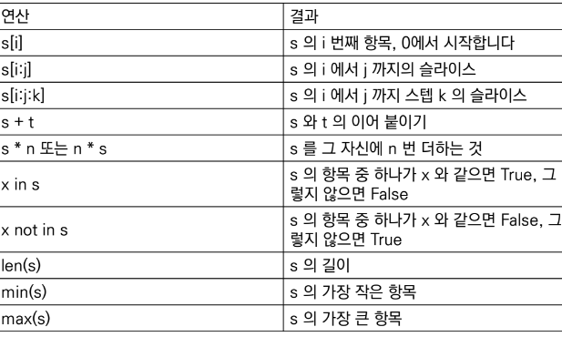

# **Python 기초**
## **파이썬 이란?**
        - Easy to learn : 다른 프로그래밍 언어보다 문법이 간단
        - Expressive Language : 타 언어보다 간결하게 작성 가능
        - 크로스 플랫폼 언어 : 다양한 운영체제에서 실행가능
        - 안터프리터 언어 : 컴파일 과정없이 바로 실행가능
        - 객체 지향 프로그래밍 : 객체(숫자, 문자, 클래스 등) 

## **객체와 변수**
### **변수**
        - 변수란 컴퓨터 메모리 어딘가에 저장된 객체를 참조하기 위해 사용
        - 변수는 할당 연산자(=)를 통해 값을 할당 : type(), id()
        - 변수 할당 : 같은 값을 동시에, 다른 값을 동시에 할당할 수 있음

### **식별자**
        - 파이썬 객체(변수, 함수, 모듈, 클래스 등)를 식별하는데 사용하는 이름(name)
        - 규칙
         1. 식별자의 이름은 영문, 언더스코어(_), 숫자로구성(첫글자에 숫자는 X)
         2. 길이 제한이 없고, 대소문자 구별
         3. 다음의 키워드는 예약어로 사용할 수 없음 
           - 
         4. 내장함수나 모듈 등의 이름으로도 만들면 안됨

### **자료형(Data Type)**
        숫자
        - 수치형 : 정수(int), 실수(float), 복소수(Complex number)
        - 불린형(Boolean Type))

        시퀸스 
        - 문자열(str), 튜플(Tuple), 리스트(List), 레인지(Range)

        컬렉션
        - 집합, 딕셔너리

        None

### **수치형**
        정수(Int)
        - 모든 정수의 타입은 int
        - 매우 큰 수를 나타낼 때 오버플로우가 발생하지 않음

        실수(Float)
        - 정수가 아닌 모든 실수는 float 타입
        - 부동소수점
        - 부동소수점에서 실수 연산 과정에서 발생 가능

        불린형(Boolean)
        - True / Flase 값을 가진 타입은 bool
        - 비교/논리 연산을 수행함에 있어서 활용됨
        - 다음은 모두 Flase로 변환(0, 0.0, (), [], {}, ", None)
   
        산술 연산자(AO)
        - 기본적인 사칙연산 및 수식계산
        - +(덧셈), -(뺄셈), *(곱셈), %(나머지), /(나눗셈), //(몫), **(거듭제곱)

        복합 연산자
        - 연산과 할당이 함께 이뤄짐
- 

        비교 연산자
        - 값을 비교하며, True / False 값을 리턴함
- 

        논리 연산자
        - 논리식을 판단하여 참(True)와 거짓(False)를 반환

|연산자|내용|
|:---:|:---:|
|A and B|A와 B 모두 True시, True|
|A or B|A와 B 모두 False시, Flase|
|Not|True를 False로, False를 True로|

>- and : 모두 참인 경우 참, 그렇지 않으면 거짓

|논리연산자 and|내용|
|:---:|:---:|
|True and True|True|
|True and False|False|
|False and True|False|
|Flase and False|False|

>- or : 둘 중 하나만 참이라도 참, 그렇지 않으면 거짓

|논리연산자 or|내용|
|:---:|:---:|
|True or True|True|
|True or False|True|
|False or True|True|
|False or False|Flase|

>- not : 참 거짓의 반대의 결과

|논리연산자 not|내용|
|:---:|:---:|
|not True|False|
|not Flase|True|

## **컨테이너**
### 컨테이너 정의
    - 컨테이너란 여러 개의 값을 담을 수 있는 것(객체)
    - 시퀀스 : 문자열, 리스트, 튜플, 레인지
>- 컬렉션 / 비시퀀스 : 세트, 딕셔너리
>   - 

        문자열
        - 모든 문자는 str 타입, 문자열은 '' 와 ""를 활용하여 표가
        - 중첩따옴표 : 따옴표 안에 따옴표 표현 가능
        - 삼중따옴표 : ''' ''', 작은 따옴표나 큰 따옴표를 삼중으로 사용(여러줄을 나워 입력할 때 편리)

        Escape sequence
        - 문자열 내에서 특정 문자나 조작을 위해서 역슬래시(\)를 활용하여 구분

|예약문자|내용|
|:---:|:---:|
|\n|줄 바꿈|
|\t|탭|
|\r|캐리지리턴|
|\o|널(Null)|
|\'|단일인용부호|
|\"|이중인용부호|

**리스트**

        - 변경 가능한 값들의 나열된 자료형
        - 순서를 가지며, 서로 다른 타입의 요소를 가질 수 있음
        - 변경 가능하면, 반복 가능함
        - 항상 대괄호 형태로 정의, 요소는 콤마로 구분
        - 생성과 접급
           - 리스트는 대괄호 혹은 list()를 통해 생성
            - 순서가 있는 시퀀스로 인덱스를 통해 접근 가능
        - 리스트 갑 추가/삭제
            - 값 추가는 .append()를 활용하여 추가하고자 하는 값을 전달
            - 값 삭제는 .pop()을 활용하여 삭제하고자 하는 인덱스를 전달

**None**

        >- 파이썬 자료형 중 하나
        >- 파이썬에서는 값이 없음을 표현하기 위해 None 타입이 존재함.
        >- 일반적으로 반환 값이 없는 함수에서 사용하기도 함.

**참고사항**

파이썬에서 제안하는 스타일 가이드
>- [PEP8](https://peps.python.org/pep-0008/) 

기업, 오픈소스 등에서 사용되는 스타일 가이드
>- [Google Style guide](https://google.github.io/styleguide/pyguide.html)
